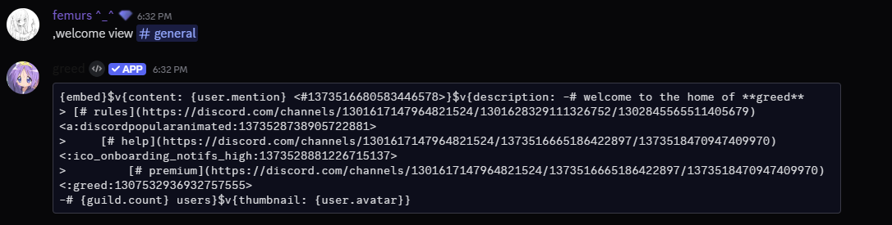

Welcome messages help greet new members and make your server more welcoming. This page explains how to set up, customize, and manage welcome messages in Greed.

## Setup

To enable welcome messages in your server, run:

```bash
,welcome setup
```

This will configure welcome messages in the current channel.

## Set the Welcome Channel

Set the channel where welcome messages will be sent:

```bash
,welcome channel #welcome
```

## Customize the Welcome Message

Set your custom welcome message with optional auto-delete:

```bash
,welcome message Welcome {user} to {server}! --auto_delete 15
```

Auto-delete is optional (1-30 seconds).

## View Current Message

You can check your current welcome message configuration at any time:

```bash
,welcome view (channel)
```

This command will display your current welcome message and its settings.



## Test Welcome

Preview your welcome message as it will appear to new members:

```bash
,welcome test (channel)
```

This command will send a test welcome message to the configured channel so you can see exactly how it looks.


## Available Variables
<Note>You can find all the variables in the [/resources/variables](/resources/variables) page.</Note>
